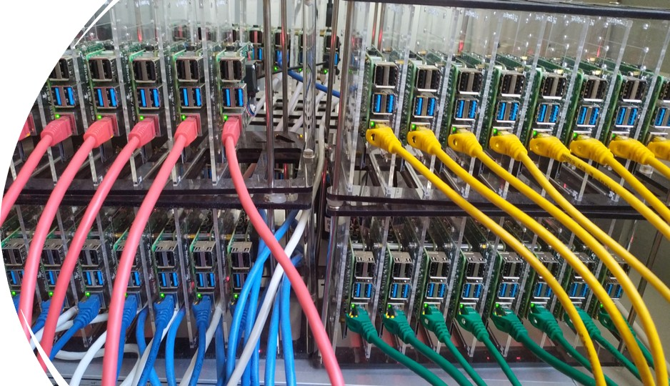

# PI-k3s-Cluster

## Description

- A Raspberry Pi cluster that consists of 16 Rasberry Pi 4 model B computers. 
- Designed for distributed program execution using K3s (a lightweight kubernetes setup).
- Goal: Running multiple simuntanious instances of lightweight ML models. 

## 📋 Project Overview

The Pi Project is an initiative by the Computing Systems Laboratory (CSLAB) that organizes student teams to build and maintain Raspberry Pi clusters. This MLOps team focuses on machine learning applications including distributed learning, IoT, and edge ML. Our flagship application is "Jen the Chatbot" - a quantized Llama model running inference the cluster. The inference app can be found here: (https://github.com/KostasTheodosiou/flask-LLM-app)!

### Architecture

- pi_login: Master node with SSD storage, provides NFS boot, DHCP, TFTP services

- pi_backup: Backup node with SD card boot, secondary DHCP, external HDD storage

- mlops_master: Kubernetes control plane, automation scripts

- Worker nodes: 16 Pis (8 yellow, 8 green) booting over NFS

